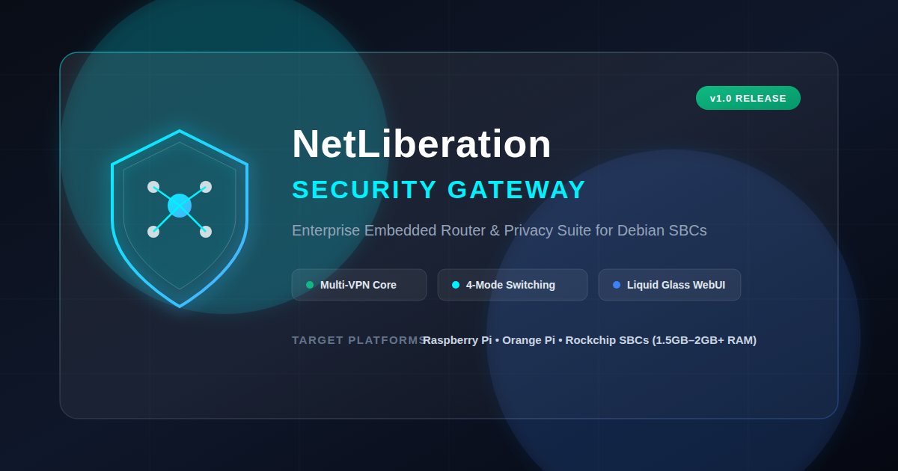

# NetLiberation Security Gateway



**NetLiberation Security Gateway** is an enterprise-grade, lightweight embedded security gateway and privacy router software suite designed for Debian-based Single Board Computers (SBCs) such as Raspberry Pi, Orange Pi, and Rockchip platforms (minimum 1.5GB–2GB RAM).

It provides automated VPN management (WireGuard, OpenVPN, L2TP, Shadowsocks/Outline, Cloudflare WARP), dynamic 4-mode network switching, native DNS ad/tracker/malware blocking, system diagnostics, thermal management, and a modern **Liquid Glass (Glassmorphism dark mode)** Web Management Panel.

---

## Key Features

- 🌐 **Dynamic 4-Mode Network Switcher:**
  - **Mode A (Default):** Eth (WAN) $\rightarrow$ Built-in Wi-Fi (LAN AP)
  - **Mode B:** USB Wi-Fi Adapter (WAN) $\rightarrow$ Built-in Wi-Fi (WLAN AP)
  - **Mode C:** Built-in Wi-Fi (WAN) $\rightarrow$ USB Wi-Fi Adapter (WLAN AP)
  - **Mode D:** Built-in Wi-Fi (WAN Client) $\rightarrow$ Eth (LAN)

- 🔒 **Automated VPN Gateway & Smart Tunneling:**
  - Multi-protocol support: WireGuard, OpenVPN, L2TP, Shadowsocks (Outline).
  - **Cloudflare WARP Integration:** Automated WARP account registration, profile generation, and 2-day pre-expiration auto-renewal timer.
  - **Outline Scraper & Auto-Rotation:** Scrapes live servers from `outlinekeys.com`, converts base64 keys into Shadowsocks JSON configs, and automatically rotates active keys if connection fails or times out.
  - **Global Kill-Switch:** Blocks non-VPN outbound WAN traffic if the active VPN drops.

- 🛡️ **Native DNS & Ad-Blocking Engine:**
  - Fast filter list compiler processing eBlocker and AdGuard Home domain blocklists without heavy external UI dependencies.
  - Whitelist & Blacklist management with live DNS query logging.
  - Encrypted upstream DNS with secure DNS-over-HTTPS (DoH) fallback.

- 🌡️ **SBC Thermal & Power Engineering:**
  - Dynamic CPU governor switching (`schedutil`, `ondemand`, `performance`, `powersave`).
  - Active SOC temperature monitoring (`/sys/class/thermal/thermal_zone0/temp`) with automated throttling mitigation.
  - USB bus power & bandwidth management to avoid USB Wi-Fi and storage controller contention.

- 🎨 **Liquid Glass Web Management Panel:**
  - Modern Glassmorphic dark mode UI built with HTML5, CSS3, dynamic JavaScript, and FastAPI backend.
  - Real-time CPU, RAM, SOC Temperature gauge and Network Speedometer graphs.
  - Connected DHCP clients monitor with live upload/download bandwidth per device.
  - Interactive network diagnostic utilities (Ping, Traceroute, Nslookup, SpeedTest).

---

## Default System Credentials & Settings

| Parameter | Default Value |
| :--- | :--- |
| **Web UI Admin Login** | `admin` / `admin` |
| **Default Wi-Fi AP SSID** | `NetLiberation` |
| **Default Wi-Fi AP Password** | `Freedom4all` |
| **Default LAN Gateway IP** | `192.168.200.254/24` |
| **DHCP IP Pool** | `192.168.200.20` – `192.168.200.200` |
| **Web UI Port** | `8000` (HTTP) / `80`/`443` reverse proxy |

---

## Hardware Requirements & Guidelines

### Minimum Requirements
- **SBC Platform:** Raspberry Pi 4/5, Orange Pi 5, Rockchip RK3399/RK3588, or equivalent.
- **RAM:** Minimum 1.5 GB (2 GB recommended).
- **Network Interfaces:**
  - 1x Ethernet Port (10/100/1000 Mbps)
  - 1x Built-in Wi-Fi module (`wlan0`)
  - 1x Mini USB Wi-Fi Adapter (`wlan1`)
- **Power Supply:** 5V / 3A USB-C / Micro-USB power supply with voltage drop protection.
- **Cooling:** Passive heatsink or active PWM cooling fan.

Detailed hardware design guidelines, thermal management, and RF channel isolation strategies can be found in [`docs/HARDWARE_ARCHITECTURE.md`](docs/HARDWARE_ARCHITECTURE.md).

---

## Quick Installation & Setup

Execute the interactive automated installation script on a fresh **Debian Linux** headless base:

```bash
sudo bash install.sh
```

### Uninstallation

To remove NetLiberation Security Gateway and restore system defaults:

```bash
sudo bash uninstall.sh
# or
sudo bash install.sh --uninstall
```

### Pre-Flight Verification Routine
The `install.sh` script executes strict pre-flight checks before installing packages or modifying network configurations:
1. **Root Privileges:** Ensures root execution.
2. **Hardware Audit:** Checks for total RAM >= 1.5GB, SOC thermal sensors, and network interfaces (1 Eth + 2 Wi-Fi).
3. **OS Compatibility:** Verifies Debian/Ubuntu OS release.
4. **Service & Port Conflict Resolution:** Scans for port conflicts on port `53` (DNS), `80`/`8000` (Web UI), and `67`/`68` (DHCP). Prompts user interactively to disable conflicting services (e.g. `systemd-resolved`, `dnsmasq`, `apache2`, `nginx`).
5. **Systemd Services & Cron Setup:** Installs `netliberation.service` system service and 7-day automatic log retention purge cron job.

---

## System Architecture Overview

```
                          +-----------------------------------+
                          |     Liquid Glass Web Management   |
                          |        Frontend (HTML/CSS/JS)     |
                          +-----------------+-----------------+
                                            | REST API / Auth
                                            v
                          +-----------------+-----------------+
                          |     FastAPI Backend Gateway       |
                          |          (Python 3.10+)           |
                          +--------+--------+--------+--------+
                                   |        |        |
        +--------------------------+        |        +--------------------------+
        |                                   v                                   |
+-------+-------+                  +----------------+                  +--------+-------+
| Network & Mode|                  |  VPN Gateway & |                  | DNS & Security |
| Controller    |                  | Auto Tunneling |                  | Engine         |
| (nftables /   |                  | (WireGuard /   |                  | (eBlocker /    |
| hostapd /     |                  | Outline / WARP)|                  | AdGuard Lists) |
| wpa_supplicant|                  +----------------+                  +----------------+
+---------------+
```

For full architectural details, see [`docs/SYSTEM_ARCHITECTURE.md`](docs/SYSTEM_ARCHITECTURE.md).

---

## REST API Documentation

The backend exposes a secure REST API with JWT Bearer authentication and rate limiting. Key API endpoints include:

- `POST /api/v1/auth/token` – Admin login
- `GET /api/v1/system/status` – Live hardware & metrics
- `POST /api/v1/system/governor` – Set CPU scaling governor
- `POST /api/v1/network/mode` – Change operation mode (Mode A / B / C / D)
- `POST /api/v1/vpn/connect` – Connect to VPN profile with iptables/nftables redirect
- `POST /api/v1/vpn/warp/generate` – Auto-generate Cloudflare WARP WireGuard profile
- `POST /api/v1/vpn/outline/fetch` – Scrape and activate active Outline key
- `POST /api/v1/dns/blocker/toggle` – Enable/Disable master ad-blocker

Complete OpenAPI schema and endpoints are documented in [`docs/API_DOCS.md`](docs/API_DOCS.md).

---

## Testing & Quality Assurance

Run the automated test suite using `pytest`:

```bash
# Run all unit, stress, and security tests
cd /opt/netliberation
pytest tests/ -v
```

### Test Coverage
- **Unit Tests:** `test_auth.py`, `test_dns.py`, `test_network.py`, `test_system.py`, `test_vpn.py`
- **Stress & Thermal Benchmarks:** `test_stress_thermal.py` (simulates heavy concurrent API load and SOC thermal monitoring)
- **Pre-Flight Checks:** Validates port conflict detection and network interface parsing.

---

## License & Maintenance

Developed for the **NetLiberation Project**. Designed for high security, privacy preservation, and hardware efficiency on resource-constrained embedded SBC systems.
